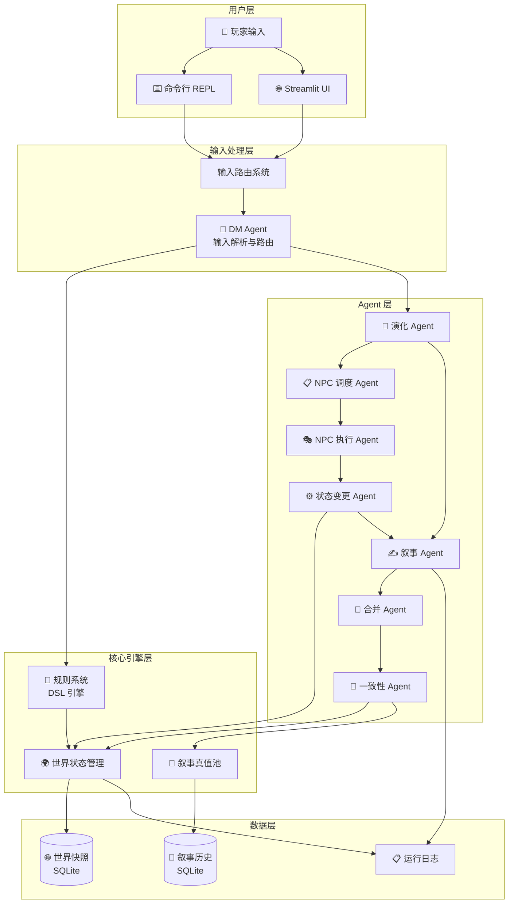
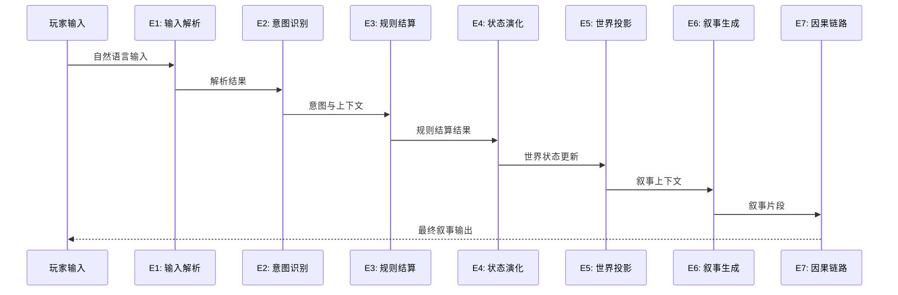

# 🧭 纸境引擎 · Paper Realm Engine

[](https://www.python.org/)
[](LICENSE)
[](https://streamlit.io/)

> 基于 LLM 的开放式文字冒险游戏引擎，采用「规则结算 + 世界状态演化 + 叙事合并」的分层架构

---

## 📖 项目简介

纸境引擎是一款基于大语言模型（LLM）的开放式游戏引擎。它通过多 Agent 协作系统实现智能叙事生成、世界状态管理和一致性校验，为玩家提供沉浸式的角色扮演体验。

### 核心设计理念

- **DSL 规则引擎**：灵活的规则描述语言，支持条件判定和状态变更
- **多 Agent 协作**：DM（地下城主）、NPC 调度、NPC 执行、叙事生成等 Agent 各司其职
- **E1-E7 因果链路**：结构化的回合处理流程，从输入解析到叙事输出的完整链路

---

## ✨ 特性亮点

| 特性 | 描述 |
|------|------|
| 🌐 **自然语言交互** | 玩家使用自然语言输入，系统智能解析并路由到对应处理模块 |
| 🎭 **智能 NPC 系统** | NPC 拥有独立的调度、执行和记忆系统，实现自主行为 |
| 🌍 **世界状态管理** | 完整的实体管理系统，支持地图、角色、物品等实体 |
| 🔍 **一致性校验** | 自动检测叙事内容与世界状态的矛盾，并提供修正方案 |
| 📝 **DSL 规则引擎** | 自定义规则描述语言，支持复杂的条件判定和状态变更 |
| 🎨 **叙事合并机制** | 多源叙事片段智能合并，生成连贯的游戏叙事 |
| 🛠️ **Streamlit 调试界面** | 实时查看回合 trace、Agent I/O、世界快照等调试信息 |
| 💾 **SQLite 持久化** | 世界快照和叙事历史持久化存储，支持回滚和复盘 |

---

## 🏗️ 系统架构



### E1-E7 回合处理链路



---

## 🚀 快速开始

### 环境要求

- Python 3.10+
- OpenAI Compatible API (如阿里云 DashScope)

### 安装步骤

```bash
# 1. 克隆仓库
git clone https://github.com/0liveiraaa/text-adventure-engine.git
cd text-adventure-engine

# 2. 创建虚拟环境（推荐）
python -m venv venv
source venv/bin/activate  # Linux/Mac
# 或
.\venv\Scripts\activate  # Windows

# 3. 安装依赖
pip install -r requirements.txt

# 4. 配置 API
# 编辑 config/config.yaml，填入您的 API Key 和模型配置
```

### 运行游戏

#### 命令行模式

```bash
python main.py
```

#### Streamlit 调试界面

```bash
streamlit run streamlit_app.py
```

打开浏览器访问 `http://localhost:8501` 即可看到交互式游戏界面。

---

## 📁 项目结构

```
engine_refacting/
├── main.py                 # 命令行游戏入口
├── streamlit_app.py        # Streamlit Web 界面入口
├── requirements.txt        # Python 依赖清单
│
├── config/                 # 配置文件目录
│   ├── config.yaml         # 主配置文件
│   ├── config.form.yaml   # 表单配置
│   └── config.schema.yaml # 配置 schema
│
├── src/                    # 核心源代码
│   ├── agent/              # Agent 实现
│   │   ├── llm/           # LLM 调用服务
│   │   │   ├── service.py           # LLM 服务基类
│   │   │   ├── input_agent.py       # DM 输入解析 Agent
│   │   │   ├── evolution_agent.py   # 演化 Agent
│   │   │   ├── narrative_agent.py   # 叙事生成 Agent
│   │   │   ├── statechange_agent.py # 状态变更 Agent
│   │   │   ├── merger_agent.py      # 叙事合并 Agent
│   │   │   ├── consistency_agent.py # 一致性校验 Agent
│   │   │   ├── npc_schedul_agent.py # NPC 调度 Agent
│   │   │   └── npc_perform_agent.py # NPC 执行 Agent
│   │   └── prompt/        # Agent 提示词模板
│   ├── config/            # 配置加载
│   ├── data/              # 数据模型
│   │   ├── model/         # Pydantic 数据模型
│   │   └── model/input/   # 输入模型
│   ├── engine/            # 游戏引擎核心
│   │   ├── engine.py      # 主引擎
│   │   ├── turn_orchestrator.py   # 回合协调器
│   │   └── consistency_orchestrator.py  # 一致性协调器
│   ├── rule/              # 规则系统
│   │   ├── dsl.py         # DSL 引擎
│   │   ├── rule_system.py # 规则系统
│   │   └── state_patch.py # 状态补丁
│   ├── storage/           # 持久化存储
│   │   ├── sqlite_narrative_repository.py
│   │   └── sqlite_world_snapshot_repository.py
│   ├── interface/         # 接口定义
│   └── utils/            # 工具函数
│
├── world/                 # 世界数据目录
│   ├── world1/           # 示例世界
│   │   ├── world.json    # 世界元数据
│   │   ├── map/          # 地图数据
│   │   ├── charactor/    # 角色数据
│   │   ├── item/         # 物品数据
│   │   └── end/          # 结局配置
│   └── world2/           # 另一个示例世界
│
├── docs/                  # 文档目录
│   └── spec/              # 规范文档
│
└── LICENSE               # MIT 许可证
```

---

## ⚙️ 配置说明

主配置文件位于 `config/config.yaml`，主要配置项：

### LLM 配置

```yaml
llm:
  api_key: YOUR_API_KEY_HERE
  api_base: https://dashscope.aliyuncs.com/compatible-mode/v1
  model: qwen3.6-plus
  temperature: 0.7
  max_tokens: 5012
  timeout: 30
  enable_reasoning: false
```

### Agent 配置

```yaml
agent:
  dm:
    memory_turns: 5        # DM 记忆窗口
  npc:
    memory_turns: 15       # NPC 长期记忆
    shortlog_turns: 30     # NPC 短日志窗口
    max_actions_per_turn: 3
  narrative:
    recent_turns: 5        # 叙事记忆窗口
```

### 存储配置

```yaml
storage:
  world:
    sqlite_path: world/world_snapshots.sqlite3
  narrative:
    sqlite_path: world/narrative_truth.sqlite3
```

---

## 🎮 创建自定义世界

### 1. 创建世界目录

```bash
mkdir -p world/my_world/{map,charactor,item,end}
```

### 2. 编写世界元数据

创建 `world/my_world/world.json`：

```json
{
  "scene_name": "我的世界",
  "default_actor_id": "char-player-0000",
  "turn_start": 1,
  "turn_limit": 50
}
```

### 3. 添加角色

创建 `world/my_world/charactor/characters.json`：

```json
{
  "characters": {
    "char-player-0000": {
      "id": "char-player-0000",
      "name": "玩家",
      "description": "一位勇敢的冒险者",
      "attributes": {
        "敏捷": 10,
        "力量": 8,
        "智力": 9
      },
      "location": "map-home-0000"
    }
  }
}
```

### 4. 定义结局

创建 `world/my_world/end/endings.json`：

```json
{
  "endings": [
    {
      "id": "ending-escape",
      "condition": "location == 'map-exit-0000'",
      "text": "恭喜你成功逃出了迷宫！"
    }
  ]
}
```

---

## 📖 DSL 规则语法

引擎支持简单的 DSL 规则用于结局判定和条件触发：

| 语法 | 说明 | 示例 |
|------|------|------|
| `==` | 等于比较 | `location == 'map-exit-0000'` |
| `!=` | 不等于 | `status != 'dead'` |
| `>` `<` `>=` `<=` | 数值比较 | `agility > 10` |
| `and` `or` | 逻辑运算 | `agility > 10 and has_key == true` |
| `in` | 包含判定 | `location in ['room1', 'room2']` |

---

## 🛠️ 调试工具

### Streamlit Debug 面板

启动 Streamlit 后，勾选侧栏「开启 Debug UI」，可以查看：

- **E1-E7 链路日志**：完整展示每个回合的处理链路
- **Agent I/O**：每个 Agent 的输入输出详情
- **世界快照**：当前世界状态的完整 JSON
- **叙事池**：已生成的叙事片段列表

### 命令行调试

```bash
# 显示完整 debug 输出
python main.py --show-debug

# 指定世界目录
python main.py --world-dir world/world2
```

---

## 📝 开发指南

### Agent 开发工作流

1. 更新 `docs/spec/draft_spec.md` 规范
2. 更新 `src/data/model/*` 数据模型
3. 更新 `src/agent/prompt/*` 提示词模板
4. 更新 `src/agent/llm/*` 调用实现
5. 更新 `src/engine/engine.py` 集成逻辑

### 代码规范

- 使用 Pydantic v2 进行数据验证
- 所有 Agent 继承 `LLMServiceBase`
- 使用类型注解提升代码可读性

---

## 📄 许可证

本项目基于 [MIT 许可证](LICENSE) 开源，您可以自由使用、修改和分发本项目。

---

## 🤝 贡献

欢迎提交 Issue 和 Pull Request！

---

## 📧 联系方式

- GitHub Issues: [https://github.com/0liveiraaa/text-adventure-engine/issues](https://github.com/0liveiraaa/text-adventure-engine/issues)

---

<div align="center">
  <sub>Made with ❤️ by the community</sub>
</div>
