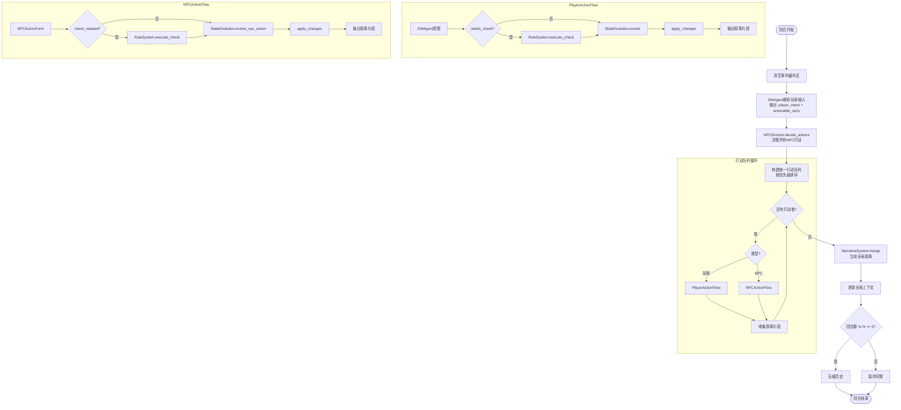

# 游戏引擎架构重构提案

> 提出时间: 2026-03-22  
> 涉及模块: GameEngine, DMAgent, NPC系统, 叙事系统

---

## 1. 背景与动机

当前游戏引擎采用 **7步回合制流程**，NPC行动存在两种模式：
- `queue` 模式：玩家输入前强制处理NPC回合
- `reactive` 模式：由DM Agent决定是否触发NPC响应

这种设计带来了以下问题：
1. **两套并行逻辑**：维护成本高，容易引入不一致性
2. **NPC与玩家通路分离**：NPC无法复用RuleSystem/StateEvolution的完整链路
3. **叙事碎片化**：各模块独立输出，缺乏全局叙事上下文

---

## 2. 重构目标

1. **统一NPC行动模式**：合并queue/reactive为单一的"统一行动队列"
2. **NPC独立系统**：让NPC走与玩家相同的互动通路（JSON表单 → RuleSystem → StateEvolution）
3. **叙事系统**：在互动结束后合并所有信息，生成全局叙事文本，作为LLM上下文

---

## 3. 详细设计方案

### 3.1 统一行动队列（合并NPC模式）

#### 设计思路

DMAgent在解析玩家输入的同时，输出**可行动NPC列表**。系统结合已有NPC行动队列和优先级计算系统，构造一次性行动队列，依次执行：
方案一
```
玩家输入
    ↓
DMAgent解析 → 输出 {player_intent, actionable_npcs: [npc_id, ...]}
    ↓
系统计算优先级 → 构造队列 [NPC1, NPC2, 玩家, NPC3]
    ↓
依次执行每个行动者

```
方案二
```
玩家输入
    ↓
DmAgent解析
    ↓
...(rule_system,state_agent)
    ↓
得到玩家的行动结果
    ↓
系统计算优先级 → 构造队列 [NPC1, NPC2, NPC3]
    ↓
 依次执行   


#### 优先级计算公式

```
使用敏捷和生命值占总生命值的比例,san值占总san值的比例,这三个自变量决定行动优先级,其中san or hp为0直接跳过,不加入队列
```

#### 数据流对比

| 维度 | 旧模式(queue) | 旧模式(reactive) | 新模式(统一队列) |
|------|--------------|------------------|------------------|
| 触发时机 | 玩家输入前 | 玩家推演后 | 由DMAgent统一规划 |
| 触发决定者 | 系统固定规则 | DM Agent | DMAgent + 系统优先级 |
| 支持多NPC连续 | ❌ | ❌ | ✅ |
| 上下文传递 | npc_prelude | npc_intent | 队列内顺序执行，状态实时更新 |

---

### 3.2 NPC独立系统（与玩家同通路）

#### 设计思路

让NPC走与玩家完全相同的互动通路，不再由LLM自由推演，而是通过**结构化JSON表单**输出决策：

```
NPC决策
    ↓
NPCActionForm (JSON表单)
    ↓
{需要检定?} → RuleSystem.execute_check()
    ↓
StateEvolution.evolve_npc_action()
    ↓
应用状态变更 + 输出叙事片段
```

#### NPCActionForm 结构

```python
class NPCActionForm(BaseModel):
    """NPC行动表单 - 结构化决策输出"""
    
    # 基础信息
    action_type: str  # attack | move | talk | use_item | wait
    target_id: Optional[str]  # 目标对象ID
    
    # 检定相关
    check_needed: bool  # 是否需要规则检定
    check_attributes: List[str]  # 检定属性 ["str", "dex", ...]
    difficulty: str  # regular | hard | extreme
    
    # 语义描述
    intent_description: str  # NPC想做什么（供StateEvolution理解）
    expected_outcome: Optional[str]  # 期望结果（可选）
```

#### 新旧流程对比

| 步骤 | 玩家通路 | NPC旧流程 | NPC新流程 |
|------|----------|-----------|-----------|
| 意图解析 | DMAgent.parse_intent() | evolve_npc_action() 直接推演 | NPCDecision.decide_action() → JSON表单 |
| 检定判断 | dm_output.needs_check | 内部判断 | action_form.check_needed |
| 检定执行 | RuleSystem.execute_check() | 独立逻辑 | RuleSystem.execute_check() **复用** |
| 状态推演 | StateEvolution.evolve_player_action() | evolve_npc_action() | StateEvolution.evolve_npc_action() **复用** |

#### NPC决策模块设计

需要一个**NPCDirector**模块来统一决策所有NPC的行动：

```python
class NPCDirector:
    """NPC导演 - 统一决策所有NPC的行动"""
    
    def decide_actions(
        self,
        npc_ids: List[str],
        game_state: GameState,
        player_intent: DMAgentOutput,
        recent_events: List[Event]
    ) -> Dict[str, NPCActionForm]:
        """
        一次性决策所有NPC的行动
        
        Args:
            npc_ids: 需要行动的NPC列表
            game_state: 当前游戏状态
            player_intent: 玩家意图（NPC需要对此做出反应）
            recent_events: 最近发生的事件
            
        Returns:
            {npc_id: NPCActionForm}
        """
        pass
```

**为什么用"导演"模式而非每个NPC独立LLM？**
- 减少token消耗（一次LLM调用vs多次）
- 更好的协调（NPC之间不会做出矛盾的决策）
- 更易于控制信息流（导演知道全局，但每个NPC只知道局部）

---

### 3.3 叙事系统（全局上下文管理）

#### 设计思路

在互动结束后合并所有信息，生成**全局叙事文本**，作为上下文加入到所有LLM的提示词中。每N回合截断一次，防止上下文爆炸。

```
回合结束
    ↓
收集所有叙事片段 [玩家叙事, NPC1叙事, NPC2叙事, 环境变化]
    ↓
NarrativeSystem.merge() → 生成全局叙事
    ↓
更新全局上下文
    ↓
{回合数 % N == 0?} → 截断/压缩历史
    ↓
供下一轮LLM使用
```

#### NarrativeContext 结构

```python
class NarrativeContext:
    """叙事上下文 - 管理全局叙事历史"""
    
    def __init__(self, window_size: int = 5):
        self.window_size = window_size  # 详细保留的回合数
        
        # 三层存储结构
        self.recent_events: List[NarrativeEvent] = []  # 最近N回合详细事件
        self.summary: str = ""  # 更早事件的压缩摘要
        self.key_facts: Set[str] = set()  # 关键事实（永不删除）
        
    def add_event(self, event: NarrativeEvent):
        """添加新事件"""
        self.recent_events.append(event)
        
        # 提取关键事实
        self._extract_key_facts(event)
        
        # 超出窗口，压缩最旧的事件
        if len(self.recent_events) > self.window_size:
            self._compress_oldest()
    
    def get_context_for_llm(self) -> str:
        """生成供LLM使用的上下文文本"""
        return f"""
【故事摘要】{self.summary}

【最近事件】
{self._format_recent_events()}

【关键事实】{', '.join(self.key_facts)}
"""
```

#### 关键事实提取规则

```python
KEY_FACT_PATTERNS = [
    r"获得了.*物品",      # 物品获取
    r"到达了.*地点",      # 位置变更
    r"HP降至.*|SAN降至.*", # 状态危险
    r"发现了.*秘密",      # 信息发现
    r"与.*对话",          # 社交关系
    r"击败了.*|被.*击败",  # 战斗结果
]

def extract_key_facts(event_text: str) -> Set[str]:
    """从事件文本中提取关键事实"""
    facts = set()
    for pattern in KEY_FACT_PATTERNS:
        matches = re.findall(pattern, event_text)
        facts.update(matches)
    return facts
```

#### 截断策略

```python
def _compress_oldest(self):
    """压缩最旧的事件到摘要中"""
    oldest = self.recent_events.pop(0)
    
    # 提取关键事实（这部分不会丢失）
    facts = self._extract_key_facts(oldest.text)
    self.key_facts.update(facts)
    
    # 用LLM生成更简洁的摘要
    compression_prompt = f"""
    请将以下叙事内容压缩为一句话摘要：
    {oldest.text}
    """
    summary_line = llm.generate(compression_prompt)
    
    # 追加到总摘要
    self.summary += f" [{oldest.turn}] {summary_line}"
```

---

## 4. 重构后的整体数据流



---

## 5. 实施计划

### 5.1 分阶段实施

| 阶段 | 任务 | 优先级 | 预计工作量 | 依赖 |
|------|------|--------|------------|------|
| Phase 1 | 实现NarrativeSystem基础结构 | P0 | 2天 | 无 |
| Phase 2 | 集成NarrativeSystem到GameEngine | P0 | 1天 | Phase 1 |
| Phase 3 | 实现统一行动队列 | P1 | 2天 | Phase 2 |
| Phase 4 | 实现NPCDirector | P1 | 3天 | Phase 3 |
| Phase 5 | 替换原有queue/reactive模式 | P1 | 2天 | Phase 4 |
| Phase 6 | 测试与调优 | P2 | 3天 | Phase 5 |

### 5.2 风险评估

| 风险 | 可能性 | 影响 | 缓解措施 |
|------|--------|------|----------|
| NPC行为变得刻板 | 中 | 高 | 保留intent_description字段，让StateEvolution保持创造力 |
| 上下文长度爆炸 | 中 | 中 | 严格的窗口机制 + 关键事实提取 |
| 单次请求延迟增加 | 高 | 中 | 多NPC并行决策，串行执行 |
| 向后兼容性问题 | 低 | 高 | 保留旧接口，逐步迁移 |

---

## 6. 接口变更

### 6.1 新增接口

```python
# src/npc/npc_director.py
class NPCDirector:
    def decide_actions(...) -> Dict[str, NPCActionForm]: ...

# src/narrative/narrative_system.py
class NarrativeSystem:
    def merge(self, fragments: List[NarrativeFragment]) -> str: ...
    def get_context(self) -> str: ...
    def truncate(self) -> None: ...

# src/data/models.py
class NPCActionForm(BaseModel): ...
class NarrativeEvent(BaseModel): ...
```

### 6.2 修改接口

```python
# DMAgent输出扩展
class DMAgentOutput(BaseModel):
    # ... 原有字段 ...
    actionable_npcs: List[str]  # 新增：推荐可行动的NPC列表

# GameEngine初始化参数
class GameEngine:
    def __init__(
        self,
        # ... 原有参数 ...
        npc_response_mode: str = "unified",  # 修改：统一模式
        narrative_window: int = 5,
    ): ...
```

---

## 7. 附录

### 7.1 参考文档

- [spec_v2_simplified.md](./spec_v2_simplified.md) - V2规范
- [game_engine.py](../../src/engine/game_engine.py) - 当前引擎实现

### 7.2 相关文件

```
src/
├── engine/
│   └── game_engine.py          # 主要修改
├── agent/
│   ├── dm_agent.py             # 输出扩展
│   └── state_evolution.py      # NPC通路复用
├── npc/                        # 新增模块
│   ├── __init__.py
│   ├── npc_director.py
│   └── npc_action_form.py
└── narrative/                  # 新增模块
    ├── __init__.py
    └── narrative_system.py
```

---


